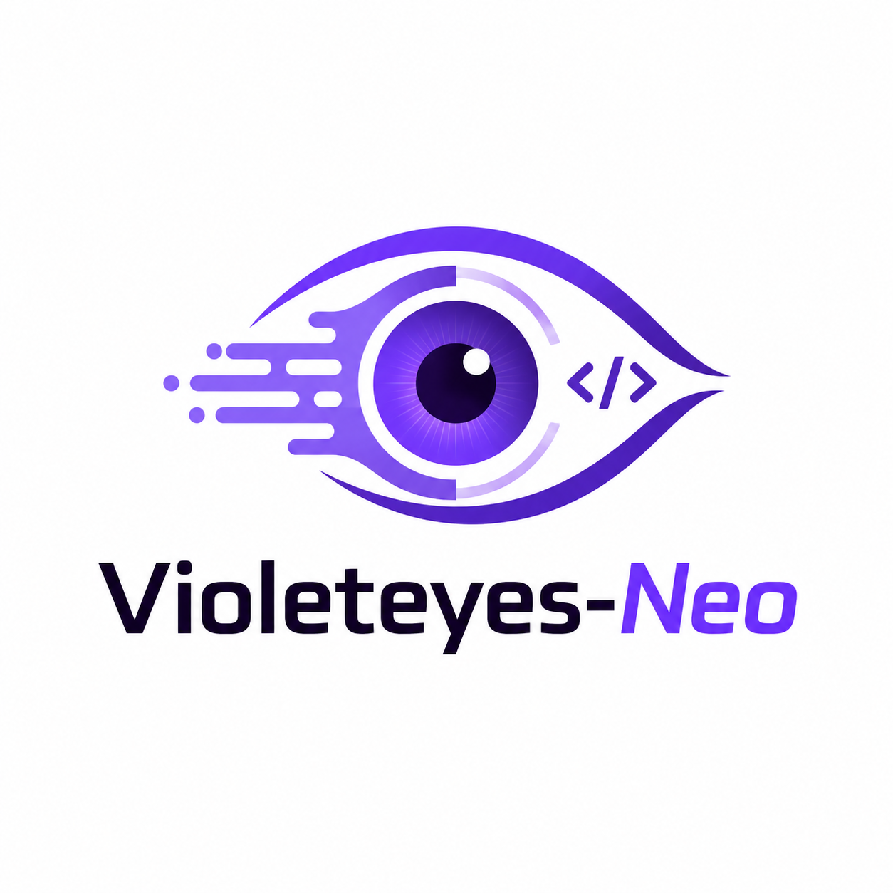

# VioletEyes-neo — Platform

> 基于 [VioletEyes v1.2.0](./SKILL.md) 的审计能力 +  的工程化形态，构建一个**多语言、可扩展、Web 化**的代码审计测试平台。

<p align="center">
  
</p>

详见 [`docs/platform/01-requirements.md`](./docs/platform/01-requirements.md)。

---

## 仓库结构

```
VioletEyes-neo/
├── apps/
│   ├── api/                 # NestJS 后端（含关键安全修复）
│   ├── web/                 # React + Vite 前端（VioletEyes 视觉）
│   └── agent/               # Python Agent Runtime（NDJSON 协议）
├── packages/
│   ├── shared/              # 跨包 TS 枚举
│   ├── skill-schema/        # SKILL.md front-matter 的 JSON Schema（TS + Python）
│   └── report-theme/        # VioletEyes 视觉 token + Tailwind preset
├── skills/                  # 内置 skill 包（violeteyes-full / framework-detect / ...）
├── templates/               # 迁自 VioletEyes v1.2 的 Jinja2 报告模板（紫罗兰主题）
├── docs/
│   └── platform/            # 平台专属文档
│       ├── 01-requirements.md
│       ├── 02-specification.md
│       └── 03-development-plan.md
├── docker-compose.yml
├── pnpm-workspace.yaml
└── README.md                ← VioletEyes 原版 Skill README（保留）
```

> VioletEyes v1.2 的 Skill 资产（`SKILL.md` / `skill.json` / `system-prompt.md` / `scripts/` / `signatures/` / `payloads/` / `workflows/` / `tests/` / `examples/`）保留在仓库根目录，**作为 platform 消费的源**而非被替换。平台通过 `skills/violeteyes-full/SKILL.md` 引用其能力。

---

## 快速开始（开发模式）

### 前置依赖

- Node.js 20 LTS
- pnpm 10+
- Python 3.11+
- Docker 24+（可选，用于 Redis）

### 安装

```bash
pnpm install
```

### 启动 Redis

```bash
docker compose up -d redis
```

### 启动 API + Web

```bash
pnpm dev
```

- API: http://localhost:3030
- Web: http://localhost:5173

### 启动 Agent Runtime（开发期单独调试用）

```bash
cd apps/agent
python3 -m venv .venv && source .venv/bin/activate  # Windows: .venv\Scripts\activate
pip install -r requirements.txt
python3 main.py
```

> 生产环境由 api 自动 spawn，无需手动启动。

---

## Docker 一键启动

```bash
docker compose up
```

访问 http://localhost:8090，默认账号 `admin / admin123`（首次登录强制改密）。

---

## 文档

### 平台

- [需求文档](./docs/platform/01-requirements.md)
- [技术规格](./docs/platform/02-specification.md)
- [开发计划](./docs/platform/03-development-plan.md)

### VioletEyes 原版 Skill

- [Skill 入口（SKILL.md）](./SKILL.md)
- [元数据契约（skill.json）](./skill.json)
- [推理合同（system-prompt.md）](./system-prompt.md)
- [报告视觉规范](./docs/05-html-report.md)

---

## License

Authorized-Testing-Only